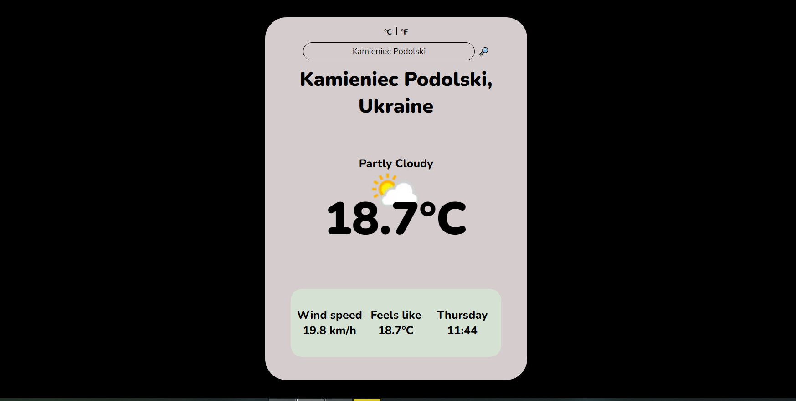

# Weather-app 

## This is my project developed while learning basic CSS and JS.
It was created as part of [The Odin Project](https://www.theodinproject.com) course, 
using the [Visual Crossing Weather API](https://www.visualcrossing.com/weather-api) to fetch real-time weather data.

## Skills Practiced
- JavaScript (ES6)
- Webpack
- DOM Manipulation
- Working with API (Visual Crossing Weather API)

## Screenshot

